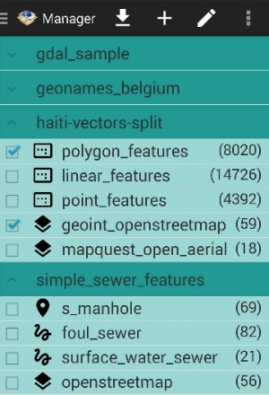
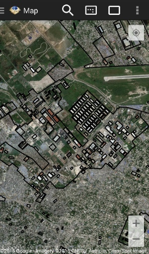
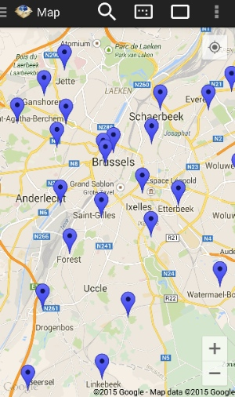
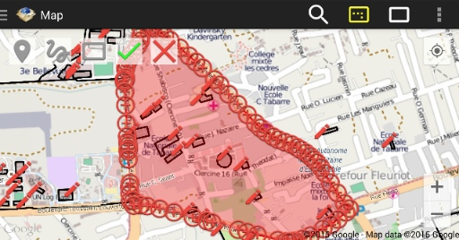
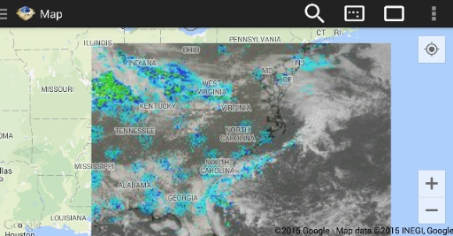

# GeoPackage SDK Sample

GeoPackage SDK Sample is an app for Android that utilizes and demonstrates the functionality in the [GeoPackage SDK](https://git.geointapps.org/geopackage/geopackage-android).  The GeoPackage SDK is an Android library implementation of the Open Geospatial Consortium [GeoPackage](http://www.geopackage.org/) [spec](http://www.geopackage.org/spec/).

The Sample app provides read and write access to GeoPackage files, including features and tiles. Features are visualized and editable on the map. Tiles are visualized on the map and can be loaded from a tile provider or WMS url.

The GeoPackage SDK Sample App was developed at the National Geospatial-Intelligence Agency (NGA) in collaboration with [BIT Systems](https://www.bit-sys.com/index.jsp). The government has "unlimited rights" and is releasing this software to increase the impact of government investments by providing developers with the opportunity to take things in new directions. The software use, modification, and distribution rights are stipulated within the [MIT license](http://choosealicense.com/licenses/mit/).

### Pull Requests ###
If you'd like to contribute to this project, please make a pull request. We'll review the pull request and discuss the changes. All pull request contributions to this project will be released under the MIT license.

Software source code previously released under an open source license and then modified by NGA staff is considered a "joint work" (see 17 USC § 101); it is partially copyrighted, partially public domain, and as a whole is protected by the copyrights of the non-government authors and must be released according to the terms of the original open source license.

### Icons ###

GeoPackage Icon is from Open Geospatial Consortium [GeoPackage](http://www.geopackage.org/).

App Icons are from [Material Design Icons on GitHub](https://github.com/google/material-design-icons) or generated at [Android Asset Studio](http://romannurik.github.io/AndroidAssetStudio).

#### Map Button Colors ####
* Grey: #989898
* Yellow: #ffff00
* Green: #00ff00
* Red: #f44336

#### Map Button Padding ####
* ic_shape_draw: 30%
* ic_shape_hole_draw: 30%
* ic_shape_edit: 50%

### License ###

    The MIT License (MIT)

    Copyright (c) 2015 BIT Systems

    Permission is hereby granted, free of charge, to any person obtaining a copy
    of this software and associated documentation files (the "Software"), to deal
    in the Software without restriction, including without limitation the rights
    to use, copy, modify, merge, publish, distribute, sublicense, and/or sell
    copies of the Software, and to permit persons to whom the Software is
    furnished to do so, subject to the following conditions:

    The above copyright notice and this permission notice shall be included in all
    copies or substantial portions of the Software.

    THE SOFTWARE IS PROVIDED "AS IS", WITHOUT WARRANTY OF ANY KIND, EXPRESS OR
    IMPLIED, INCLUDING BUT NOT LIMITED TO THE WARRANTIES OF MERCHANTABILITY,
    FITNESS FOR A PARTICULAR PURPOSE AND NONINFRINGEMENT. IN NO EVENT SHALL THE
    AUTHORS OR COPYRIGHT HOLDERS BE LIABLE FOR ANY CLAIM, DAMAGES OR OTHER
    LIABILITY, WHETHER IN AN ACTION OF CONTRACT, TORT OR OTHERWISE, ARISING FROM,
    OUT OF OR IN CONNECTION WITH THE SOFTWARE OR THE USE OR OTHER DEALINGS IN THE
    SOFTWARE.

### Dependencies ###

#### [GeoPackage SDK](https://git.geointapps.org/geopackage/geopackage-android) ####
The MIT License (MIT)

#### [aFileChooser](https://github.com/iPaulPro/aFileChooser) ####

Modified Version of: src/com/ipaulpro/afilechooser/utils/FileUtils.java

Apache License, Version 2.0

### Screen Shots ###

Manager View with GeoPackages linked at Open Geospatial Consortium [GeoPackage] (http://www.geopackage.org/#sampledata)
 
* [Technology Test Data Set] (http://www.geopackage.org/data/gdal_sample.gpkg)
* [Geonames data for Belgium] (http://www.geopackage.org/data/geonames_belgium.gpkg)
* [Haiti OpenStreetMap tiles and point features] (http://www.geopackage.org/data/haiti-vectors-split.gpkg)
* [Simple Sewers test data set] (http://www.geopackage.org/data/simple_sewer_features.gpkg)

[Haiti Polygon Features] (http://www.geopackage.org/data/haiti-vectors-split.gpkg)

[Belgium Point Features] (http://www.geopackage.org/data/geonames_belgium.gpkg)

Editing [Haiti Features] (http://www.geopackage.org/data/haiti-vectors-split.gpkg) with [OpenStreetMap] (http://www.openstreetmap.org/#map=5/51.500/-0.100) tiles

[nowCOAST] (http://nowcoast.noaa.gov) tiles

