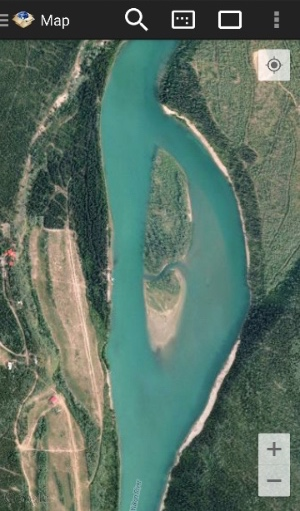

# GeoPackage MapCache Android

#### MapCache Android ####

The [GeoPackage Libraries](http://ngageoint.github.io/GeoPackage/) were developed at the [National Geospatial-Intelligence Agency (NGA)](http://www.nga.mil/) in collaboration with [BIT Systems](http://www.bit-sys.com/). The government has "unlimited rights" and is releasing this software to increase the impact of government investments by providing developers with the opportunity to take things in new directions. The software use, modification, and distribution rights are stipulated within the [MIT license](http://choosealicense.com/licenses/mit/).

### Pull Requests ###
If you'd like to contribute to this project, please make a pull request. We'll review the pull request and discuss the changes. All pull request contributions to this project will be released under the MIT license.

Software source code previously released under an open source license and then modified by NGA staff is considered a "joint work" (see 17 USC § 101); it is partially copyrighted, partially public domain, and as a whole is protected by the copyrights of the non-government authors and must be released according to the terms of the original open source license.

### Android App ###

[Download the latest APK](https://github.com/ngageoint/geopackage-mapcache-android/releases/latest)

### About ###

[GeoPackage MapCache](http://ngageoint.github.io/geopackage-mapcache-android/) is a [GeoPackage Library](http://ngageoint.github.io/GeoPackage/) app for Android that utilizes and demonstrates the functionality in [GeoPackage Android](https://github.com/ngageoint/geopackage-android) and [GeoPackage Android Map](https://github.com/ngageoint/geopackage-android-map).  The GeoPackage SDKs are Android library implementations of the Open Geospatial Consortium [GeoPackage](http://www.geopackage.org/) [spec](http://www.geopackage.org/spec/). The app and SDK are listed as [OGC GeoPackage Implementations](http://www.geopackage.org/#implementations_nga) by the National Geospatial-Intelligence Agency.

The MapCache app provides read and write access to GeoPackage files, including features and tiles. Features are visualized and editable on the map. Tiles are visualized on the map and can be loaded from a tile provider or WMS url.

### Screen Shots ###

Manager View with GeoPackages linked at Open Geospatial Consortium [GeoPackage](http://www.geopackage.org/#sampledata)
 
* [Technology Test Data Set](http://www.geopackage.org/data/gdal_sample.gpkg)
* [ERDC Whitehorse Tiles](https://portal.opengeospatial.org/files/63156)

Haiti Polygon Features

Belgium Point Features

Editing Haiti Features with [OpenStreetMap](http://www.openstreetmap.org) tiles

[nowCOAST](http://nowcoast.noaa.gov) tiles

[Whitehorse](https://portal.opengeospatial.org/files/63156) tiles

### Build ###

Build this repository using Android Studio and/or Gradle. Run the "assembleRelease" task on the geopackage-mapcache-android Gradle script.

### Icons ###

GeoPackage Icon is from Open Geospatial Consortium [GeoPackage](http://www.geopackage.org/).

App Icons are from [Material Design Icons on GitHub](https://github.com/google/material-design-icons) or generated at [Android Asset Studio](http://romannurik.github.io/AndroidAssetStudio).

#### Map Button Colors ####
* Grey: #989898
* Yellow: #ffff00
* Green: #00ff00
* Red: #f44336

#### Map Button Padding ####
* ic_shape_draw: 30%
* ic_shape_hole_draw: 30%
* ic_shape_edit: 50%

### Dependencies ###

#### Remote ####

* [GeoPackage Android Map](https://github.com/ngageoint/geopackage-android-map) (The MIT License (MIT)) - GeoPackage Library

#### Embedded ####

* [aFileChooser](https://github.com/iPaulPro/aFileChooser) (Apache License, Version 2.0) - Uri Paths using modified FileUtils
